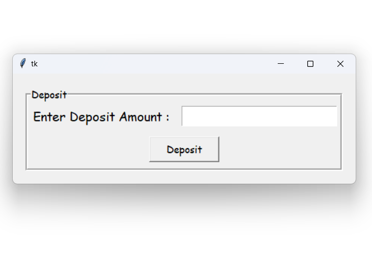
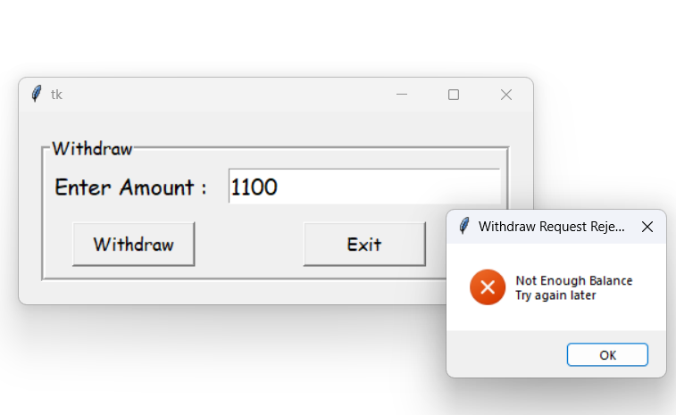

# Arshad Banking Services

Welcome to the Arshad Banking Services Python application. This application allows users to create accounts, log in, check their account balances, and perform deposits and withdrawals.

## Project Files

- **arshad123.txt**: A sample text file that is created when a user signs up. It stores the user's password and balance.

- **bankmain.py**: The main Python script containing the application code.

## Features

### Sign Up

To create a new account, follow these steps:

1. Click on the "Sign Up" button.
2. Provide a unique username and a 4-digit password.
3. Confirm the password.
4. Click "Submit" to complete the signup process.

### Login

If you already have an account, follow these steps to log in:

1. Click on the "Login" button.
2. Enter your username and password.
3. Click "Submit" to log in.

Upon successful login, you can access the following features:

### Enquiry

- To check your account balance, click on the "Enquiry" button after logging in.

### Deposit

- To deposit money into your account, click on the "Deposit" button after logging in. Enter the amount you want to deposit, and the application will update your balance.

### Withdraw

- To withdraw money from your account, click on the "Withdraw" button after logging in. Enter the amount you want to withdraw, and the application will update your balance if you have sufficient funds.

## Running the Application

1. Ensure you have Python installed on your system.
2. Run the `bankmain.py` script.

## Screenshots

 
 
 
 
 
 
 
 
 
 
 
 

## Note

- User account information is stored in text files with the format "username.txt". Each file contains the user's password and balance.

### Example Account File (arshad123.txt)
    1234
    1900

- Passwords should be 4 digits only.

Please note that this application is a basic example and is not suitable for use in a real banking environment. It is intended for educational purposes only.

Enjoy using the Arshad Banking Services application!
